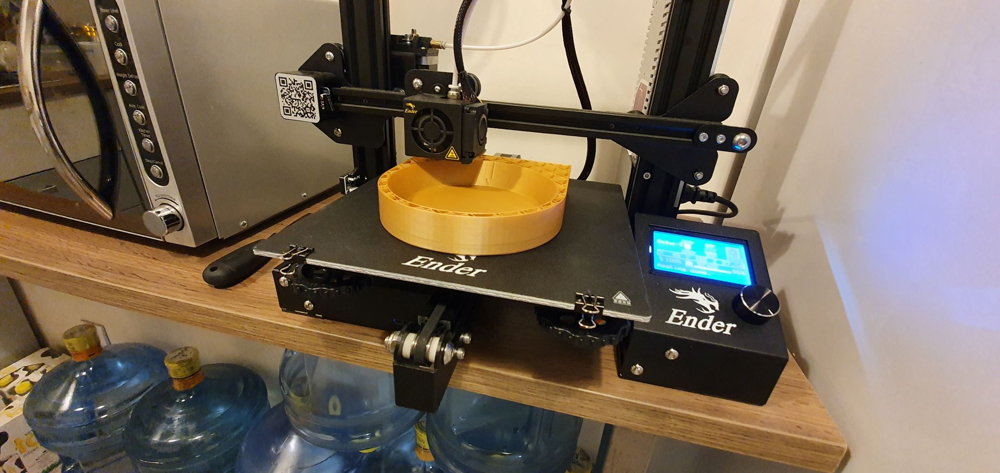
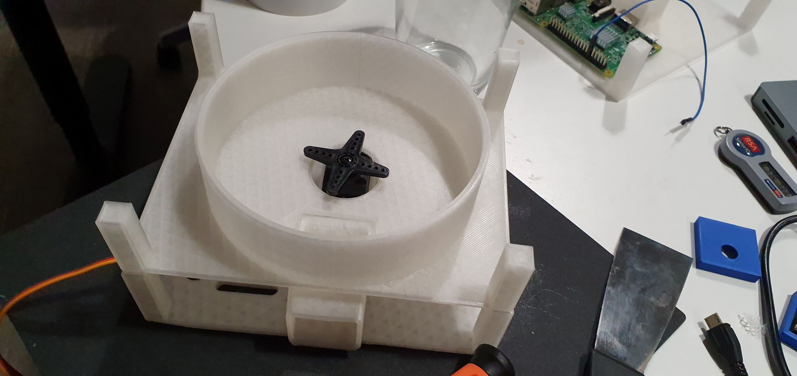
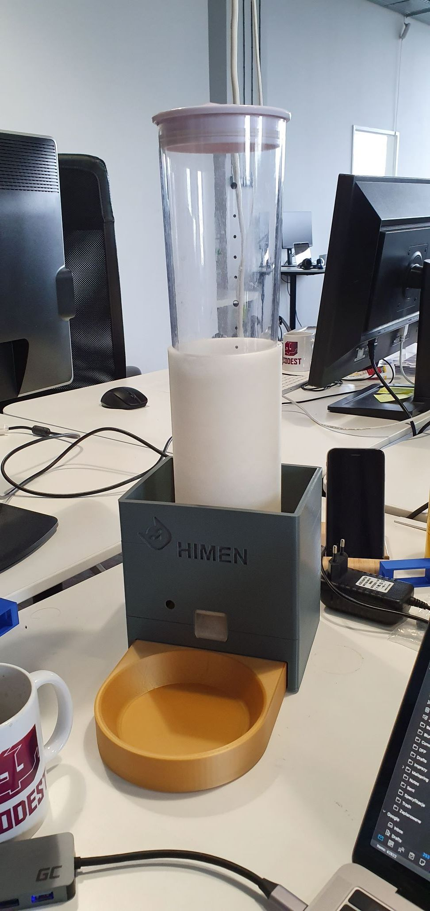
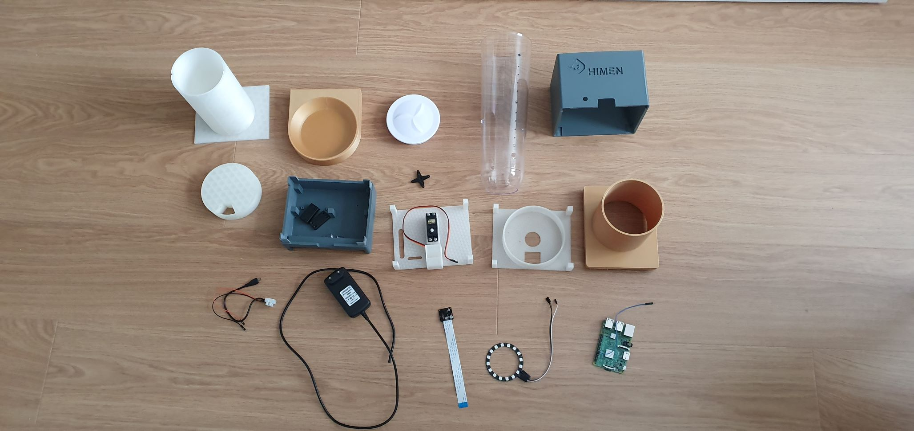

## Automatic Cat Feeder


Imagine, it is 6:00 AM Saturday morning, you are laying comfortably in the bed, sleeping nicely. Suddenly you hear cat is scratching on the door, loud meows become unbearable and your cat has infinite time to let you know what he needs. Do you know what he needs? I know what he wants. He needs food now! Right now! Because once upon time, in old days I've given him a food at that time... And of course it became a new standard time for feeding.

This situation gave me an idea to build automatic cat feeder, that would remove troublesome morning cat feeding and of course make cat happy.

### First generation

First generation of the cat feeder was simple MVP created using some cardboard, simple servo and ESP WeMos. It worked using servo to rotate by 180 degrees top container to dispense food.

<iframe width="960" height="415" src="https://www.youtube-nocookie.com/embed/XM9isy4HUUo" frameborder="0" allow="accelerometer; autoplay; encrypted-media; gyroscope; picture-in-picture" allowfullscreen></iframe>

Microcontroller connected to my local WiFi and communicated with Smart Home server running HomeAssistant over MQTT protocol. Thanks to that, I was able to use HomeAssistant automation system to schedule feeding and dispensing food through Google Home commands. Scheduling for feeding was defined as special events in Google Calendar. It allowed me to easliy control cats feeding time and change it when needed.

Of course this implementation had some problems:

* sometimes top container had been breaking away from servo handle and had spilled whole food (I've been calling it "The Jackpot Effect"),
* it didn't have the best looks,
* cardboard started to deteriorate.

As with most MVP it had been used on production for 2 years until it finally broke.

### Second generation

I have decided that next cat feeder should:

* be built from 3D printed parts,
* use Raspberry Pi 3,
* have small camera to watch, how cat is reacting and wht he is doing.

I have started whole process from designing basic elements for food paritioning. Than, when designs were ready, all modeled elements were printed using Creality Ender-3 and PLA transparent filament:

<iframe width="960" height="315" src="https://www.youtube-nocookie.com/embed/3vbX-7o-h1c" frameborder="0" allow="accelerometer; autoplay; encrypted-media; gyroscope; picture-in-picture" allowfullscreen></iframe>

#### Parts
After ensuring that everything is working, I proceeded to design and print rest of parts:

##### Base for RaspberryPi (Level 0)


It has special places for screws to install Raspberry Pi. Additionaly, on the front, there is a small hole for easy access to Raspberry Pi SD card.

##### Bowl holder

This plastic part is used for placing metal food bowl (of course it was printed using gold filament, for cats fame and glory). It is connected with base using 2 neodymium magnets.



##### Servo holder (Level 1)

This level is used for holding servo while it rotates part on the next level. It also has small slope for better food serving.


##### Ration mechanism container (Level 2)

This is just generic level that portions food from container placed above. It is rotated by servo.



##### Food container holder (Level 3)

This part is used for holding food container. Food container is only one plastic part that is not 3D printed. The reasoning was that I wanted to minimize food contact with 3D printed parts. In theory used transparent PLA plastic don't have any toxic contaminants, but just to be sure, I bought the cheapest cereal dispenser and took the food container part. Also, it looks really cool.



##### Housing and lid

The last two parts were housing and lid. Nothing special here, except more gold for even better looks and cats admiration.


##### All parts



##### Final assembly


#### Software

Raspberry Pi is running raspbian provisioned using [ansible playbook](https://github.com/macbury/SmartHouse/blob/master/provision/playbooks/cat_feeder/cat.yaml) to run these services:

##### MotionEye

Motioneye is opensource software for building your own private monitoring solution. It detects any camera connected to Raspberry Pi. Additionaly, out of the box, you get motion detection, endpoint for sharing stream and webhook support.

##### Servo service

This service controls rotation of the servo. It is simple python script that connects to MQTT server running my smart house software and awaits for message triggering rotation.

##### Led service

As servo service, it implements protocol for light source controlled by MQTT in [HomeAssistant](https://www.home-assistant.io/integrations/light.mqtt/)

##### Home assistant automation

And finally the HomeAssistant automation that triggers feeding.

It triggers feeding in two situations:

* if feeding time in calendar appears,
* if International Space Station is above my home location.

This automation looks like this:

```YAML
- alias: Feed the cat
  trigger:
    - platform: state
      entity_id: 'binary_sensor.iss'
      from: 'off'
      to: 'on'
    - platform: state
      entity_id: calendar.cat_feed_schedule
      from: 'off'
      to: 'on'
  action:
    - service: script.feed_the_cat

```

### Summary

It is obvious, that this version isn't the last one. But it serves it's purpuse - cat is well nourished and I have easier mornings :)

<iframe width="960" height="315" src="https://www.youtube-nocookie.com/embed/UsKsxxO5i4k" frameborder="0" allow="accelerometer; autoplay; encrypted-media; gyroscope; picture-in-picture" allowfullscreen></iframe>