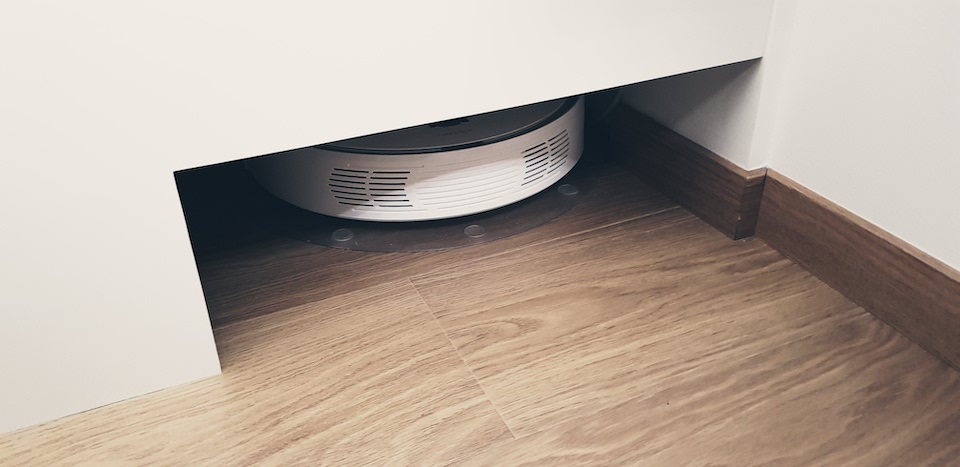
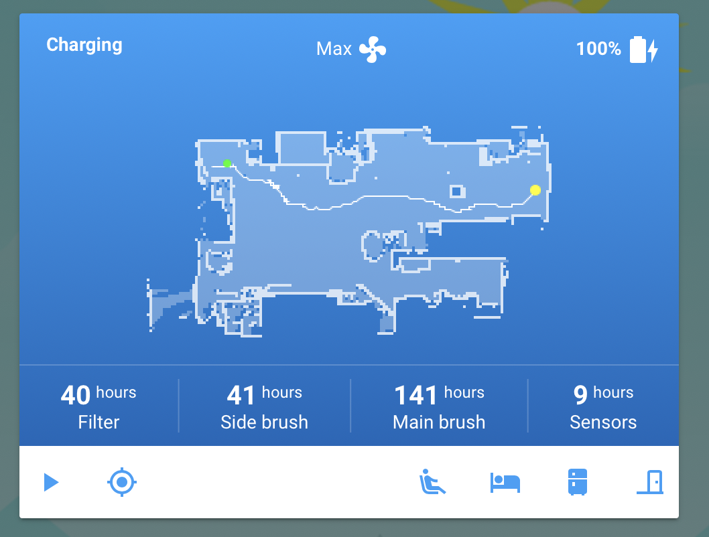
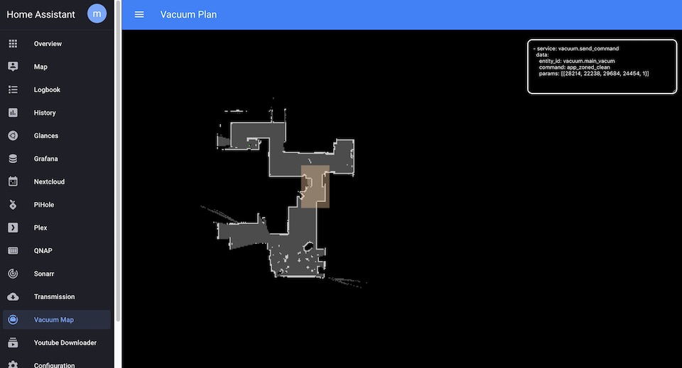

All stuff related to my Xiaomi Vacuum

## Configuration

Current firmware **v11_001730.fullos.pkg**

[Whole process of jailbreaking](https://github.com/dgiese/dustcloud/wiki/VacuumRobots-manual-update-root-Howto)

I really did not want to install ansible stuff on my vacuum, so here are few commands that were used to jailbreak and install simple scripts:

```bash
sudo ./imagebuilder.sh --firmware v11_001730.fullos.pkg --public-key=id_rsa.pub --timezone=Europe/Warsaw

mirobo --ip=192.168.8.1 --token=#token# raw-command miIO.ota '{"mode":"normal", "install":"1", "app_url":"http://192.168.8.51:8000/v11_001730.fullos.pkg", "file_md5":"#md5#","proc":"dnld install"}'

scp vacuum/upload_map.sh 192.168.1.222:/root/upload_map.sh
scp vacuum/watch_map.sh 192.168.1.222:/root/watch_map.sh

EDITOR=nano crontab -e

@reboot sh /root/watch_map.sh >> /tmp/watch_map.log 2>&1

reboot
```

### Endpoint for live map 

There is also a simple node js server that handles request from `watch_map.sh` and renders nice map. The map is registered as [generic camera](https://www.home-assistant.io/components/generic/). To prevent malicious posts there is also firewall level guard, that restricts access to this endpoint. 

### Lovelace Card



For the UI I have created custom lovelace card: [vacuum-card](https://github.com/macbury/SmartHouse/tree/master/home-assistant/www/custom-lovelace/vacuum/). 

You can specify what vacuum should be controlled, from where to fetch map camera output. Additionaly there is option for adding buttons that can trigger services. This is used for triggering zone cleanups in diffrent rooms.

```yaml
- type: custom:vacuum-card
  entity: vacuum.main_vacuum
  map: camera.vacuum_map
  actions:
    - name: Clean living room
      service: script.clean_living_room
      icon: mdi:seat-recline-extra
    - name: Clean bedroom
      service: script.clean_bedroom 
      icon: mdi:hotel
    - name: Clean kitchen
      service: script.clean_kitchen
      icon: mdi:fridge
    - name: Clean corridor
      service: script.clean_corridor
      icon: mdi:door-closed
```

### Zone Cleanup Panel 
With newest firmware update Xiaomi introduced **Map Saving**. This feature makes planned zone cleanup to actually work(before after few cleanings, robot did reset the map and need to scan the whole apartament again). To help me with preparing zone cleanup, I written a simple tool that takes generated map and allows me to select zones for cleaning:



After selecting area text area is updated with YAML that can look like this:

```yaml
- service: vacuum.send_command
  data:
    entity_id: vacuum.main_vacum
    command: app_zoned_clean
    params: [[27542, 20818, 28986, 22288, 1]]
```
